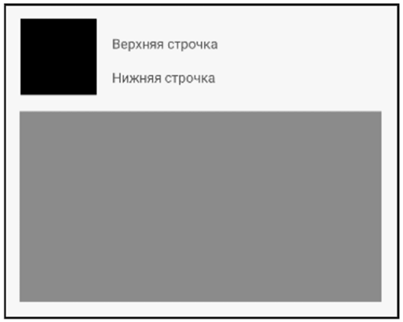
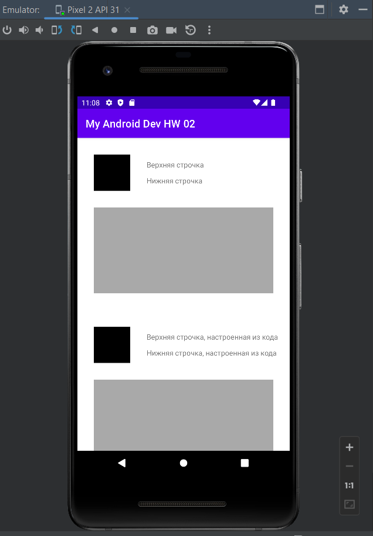

# Урок 2. Вёрстка экранов

Цель практической работы
Потренироваться применять знания по основным ViewGroup.

Что нужно сделать:
Создайте CustomView по примерному шаблону какого-либо поста в соцсети (смотрите картинку), 
используя знания о ViewGroup.

Вёрстка должна быть с отступами (все отступы в макете 16dp).
CustomView должен встраиваться в main_activity.xml и отображаться при запуске приложения.
Тексты внутри виджетов «Верхняя строчка» и «Нижняя строчка» должны настраиваться 
из кода MainActivity. 
Например: из кода MainActivity настройте CustomView так, чтобы отобразилось «верхняя строчка, 
настроенная из кода», «нижняя строчка, настроенная из кода».

==============================================================================
## Демонстрация решения:
